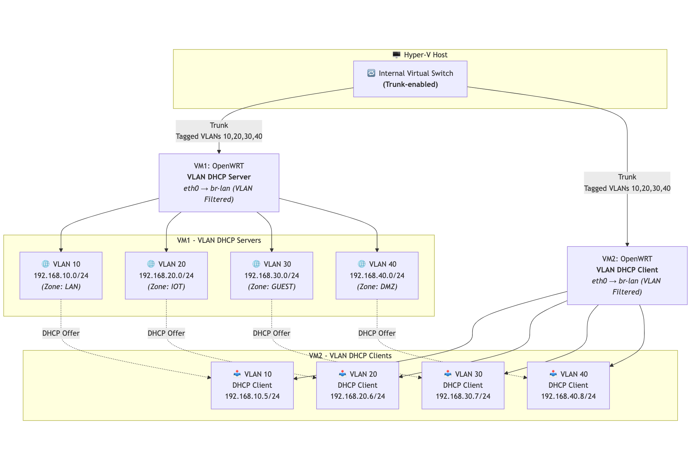

# Vlan-Hyperv-Openwrt
Step-by-step guide for configuring VLAN-to-VLAN routing between two OpenWRT VMs on Hyper-V

## Introduction

The goal of this project is to enable communication between two or more virtual machines using an internal virtual adapter on Microsoft Hyper-V, running on Windows Server 2022, with support for passing VLAN-tagged and trunked traffic. By default, Hyper-V does not support VLAN trunking on internal switches through its GUI. Therefore, this functionality must be configured via PowerShell.

This guide provides step-by-step instructions for a setup where VM1 (running OpenWRT) exposes VLAN10, VLAN20, VLAN30, and VLAN40 through a single internal virtual adapter. That adapter acts as a trunk and connects to VM2 (also running OpenWRT), which expects those same VLANs on its LAN port. 

The objective is to use the shared internal adapter as a trunk port to carry tagged VLAN traffic between the two VMs. To verify successful communication, VM1 will run DHCP servers on separate subnets for each VLAN, and VM2 will be configured as a DHCP client on those VLAN interfaces. If VM2 receives IP addresses correctly from VM1, the trunk setup is confirmed to be working.

## 🗺️ VLAN Setup Overview

